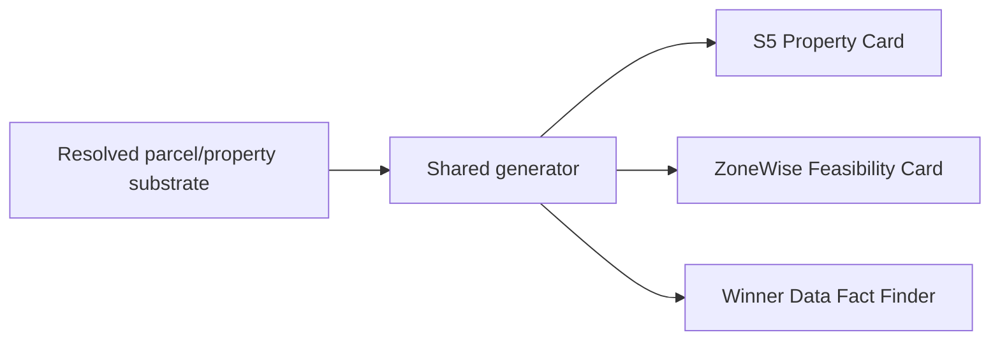

# CANON 03 — Product & Avatar Map

**Canon overrides any log, memory line, or prior chat.** See [`README.md`](README.md).
Authoritative as of Aug 24 2026.

## Shape: one substrate, one generator, three faces

This is the literal mechanism behind the "one resolution event, N verticals"
moat claim in [`01_WINNER_DATA_CANON.md`](01_WINNER_DATA_CANON.md#moat): all
three faces read from the same resolved substrate through the same
generator. A new face is a new template on top of existing infrastructure,
not a new pipeline.

## Fact Finder verticals

| Vertical | Status | Fields |
|---|---|---|
| Insurance | **Proven** (live, Protection Partners) | Standard property risk/underwriting fields |
| Moving | Template gap — not yet built | Home size, bedrooms, stories, garage, lot access, listing status + days on market, move window, destination signal. **Explicitly NOT** roof age or wind mitigation (those are insurance-specific and out of scope for a moving Fact Finder) |
| Contractor | Later | Not yet scoped |

## Signal sources

- **`seller_signals`** — MLS active/pending listings, resolved via
  `fl_parcels.own_name`. No skip-tracing involved; the signal comes from the
  public MLS listing state matched against the parcel owner-of-record.
- **`winner_signals`** — auction winners, resolved to their owned-property
  mailing address, enriched via Tracerfy (~88% hit rate).

Both signal sources feed the shared substrate above; neither involves
contacting the underlying homeowner (see
[`02_COMPLIANCE_DOCTRINE.md`](02_COMPLIANCE_DOCTRINE.md)).
